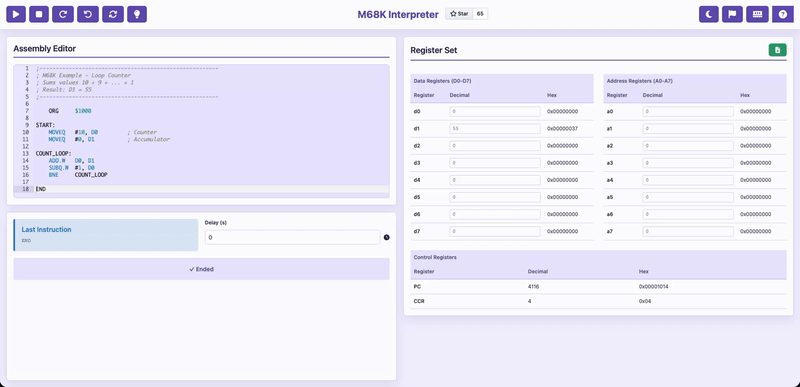

# m68k-interpreter

**Rebuilt a Motorola 68000 emulator with 50+ instructions — runs entirely in the browser, no install.**

A fully-featured m68k assembly IDE for learning computer architecture. Write, step through, debug, and inspect register state — all without leaving your browser.

**NOTE:** This project will be in maintenance mode during the summer of 2026 as I focus on other projects and learning paths. While I may continue to make small improvements, the project will not be actively developed until September 2026, when I hope to return to it and fix any remaining bugs. If you are interested in contributing, please reach out, open a [GitHub issue](https://github.com/gianlucarea/m68k-interpreter/issues) or submit a pull request.

**[→ Live demo](https://gianlucarea.dev/m68k-interpreter/)**

[](https://github.com/gianlucarea/m68k-interpreter/actions)
[](https://codecov.io/gh/gianlucarea/m68k-interpreter)

## Quick Start

```bash
git clone https://github.com/gianlucarea/m68k-interpreter.git
cd m68k-interpreter
npm install
npm run dev
```

Then open [http://localhost:3000](http://localhost:3000) and start coding.

## Demo



*Step through assembly code with live register inspection, memory viewer, and detailed error reporting.*

## Table of Contents

- [Why This Exists](#why-this-exists)
- [Features](#features)
- [Architecture & Design](#architecture--design)
- [Supported Instructions](#supported-instructions)
- [Examples](#examples)
- [For Educators](#for-educators)
- [Contributing](#contributing)
- [License](#license)

## Why This Exists

[Easy68K](http://www.easy68k.com/) is the standard tool for learning m68k assembly in university courses. It's Windows-only, requires installation, and hasn't been updated in years. This runs in any browser, on any OS, with zero setup — ideal for educators and students.

## Features

- Step-by-step execution with full undo/redo history
- Live register viewer and memory inspector
- Detailed error reporting with line context
- Preloaded examples covering common patterns
- Export register and memory state to file

## Supported instructions

**Data movement** — `MOVE` `MOVEA` `MOVEQ` `MOVEM` `MOVEP` `LEA` `PEA` `CLR` `EXG` `SWAP`  
**Integer arithmetic** — `ADD` `ADDA` `ADDI` `ADDQ` `ADDX` `SUB` `SUBA` `SUBI` `SUBQ` `SUBX` `MULS` `MULU` `DIVS` `DIVU` `NEG` `NEGX` `EXT` `CLR` `CMP` `CMPA` `CMPI` `CMPM` `TST`  
**Logical operations** — `AND` `ANDI` `OR` `ORI` `EOR` `EORI` `NOT`  
**Shift & rotate** — `ASL` `ASR` `LSL` `LSR` `ROL` `ROR` `ROXL` `ROXR`  
**Bit manipulation** — `BTST` `BSET` `BCLR` `BCHG`  
**CCR operations** — `ANDI to CCR` `ORI to CCR` `EORI to CCR` `MOVE to CCR` `MOVE from CCR`  
**Program control & branching** — `BRA` `BSR` `Bcc` (`BHI` `BLS` `BCC` `BCS` `BNE` `BEQ` `BVC` `BVS` `BPL` `BMI` `BGE` `BLT` `BGT` `BLE`) `DBcc` (`DBHI` `DBLS` `DBCC` `DBCS` `DBNE` `DBEQ` `DBVC` `DBVS` `DBPL` `DBMI` `DBGE` `DBLT` `DBGT` `DBLE` `DBF` `DBT`) `Scc` (`SHI` `SLS` `SCC` `SCS` `SNE` `SEQ` `SVC` `SVS` `SPL` `SMI` `SGE` `SLT` `SGT` `SLE` `SF` `ST`) `JMP` `JSR` `RTS` `RTR` `RTD`  
**System control & exceptions** — `RESET` `NOP` `STOP` `RTE` `TRAP` `TRAPV` `CHK` `LINK` `UNLK` `MOVE to SR` `MOVE from SR` `ORI to SR` `ANDI to SR` `EORI to SR` `TAS`

## Examples

The [`examples/`](./examples) folder contains annotated programs to get started:

| File | What it demonstrates |
| --- | --- |
| `fibonacci.asm` | Loops, D registers, branching |
| `factorial.asm` | Recursion via JSR/RTS, stack discipline |
| `bubble_sort.asm` | Nested loops, memory addressing, CMPI |
| `stack_ops.asm` | MOVE to/from stack pointer, subroutine conventions |
| `hello_world.asm` | Basic MOVE and output |
| `loop_counter.asm` | DBRA countdown loop |

Each file is commented line by line — useful if you are following a computer architecture course.

## Development

```bash
npm run build        # production build
npm run test         # run tests
npm run test:ui      # vitest UI
npm run test:coverage # coverage report
npm run lint:fix     # lint and format
npm run type-check   # check TypeScript
```

## Architecture & Design

**Tech Stack:** React 18, TypeScript, Vite 5, Zustand (state), Vitest

**Key Design Decisions:**

- **Zero-Dependency CPU Core:** Instead of using an external emulation library, the entire m68k CPU and instruction set is hand-implemented in TypeScript. This keeps the bundle lean and gives full transparency into how the emulator works — valuable for education.

- **Register State Management:** Zustand manages CPU state (registers, memory, program counter, flags). React re-renders only changed registers, keeping the UI responsive even with large memory states.

- **Instruction-by-Instruction Execution:** Full undo/redo history powered by immutable state snapshots. Each step is reversible, making debugging and learning faster.

- **Custom Parser:** Hand-rolled m68k assembly parser with precise error reporting and line context — no external grammar tools.

## For Educators

If you teach a course that uses Easy68K, this works as a drop-in browser-based alternative — no student setup required. If you use it in your course and want it listed here, open an issue or send an email.

## Acknowledgments

Special thanks to [MarkeyJester's Motorola 68000 Beginner's Tutorial](https://mrjester.hapisan.com/04_MC68/Index.html) — an excellent reference for instruction behavior, cycle times, and assembly fundamentals that informed this implementation.

## Contributing

PRs welcome. See [CONTRIBUTING.md](CONTRIBUTING.md).

## License

MIT
